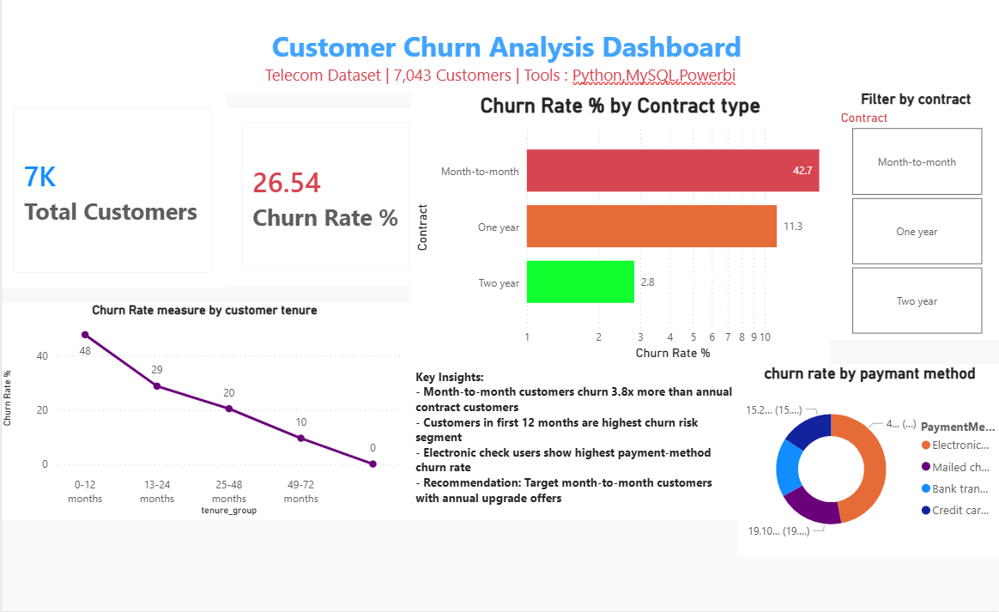

# Churn_Dashboard
## Dashboard Preview

## Power BI Dashboard Contains:
- KPI Cards: Total Customers, Churn Rate %
- Bar Chart: Churn rate breakdown by contract type
- Line Chart: Churn trend across customer tenure groups  
- Donut Chart: Churn distribution by payment method
- Interactive slicer: Filter all visuals by contract type
